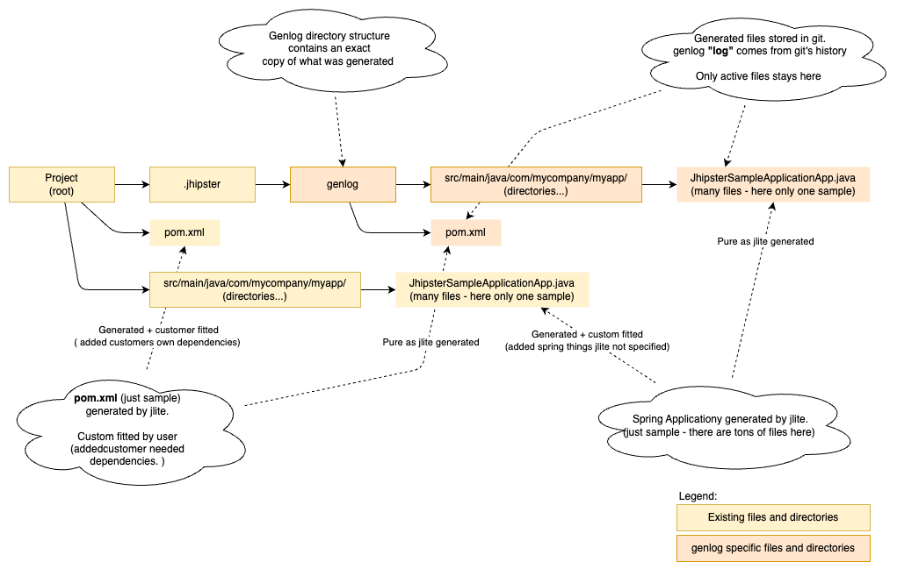
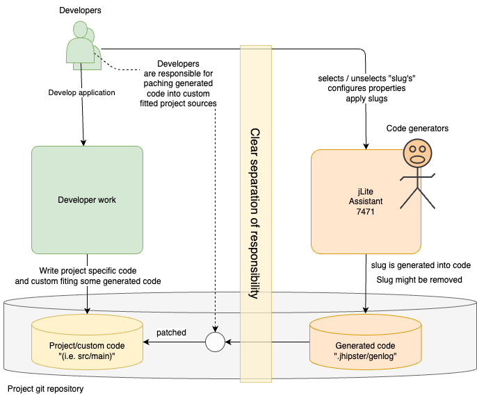

# GenLog

GenLog is a Git committed mirror of the generated from jLite.

Figure: Genlog mirror directories and files.

- Genlog contains relevant generated files as a mirror
- jLite updates both **_genlog_** and **_source_** tree.
- Source tree is merged. See [Merge](MERGE.md)
- Genlog documents 100% what code has been generated by Jhipster Lite.
- Separation responsibility is separated into two different directory trees.
- Uses can see what differences they have added to jLite generated files by diff **_project_** vs **_genlog_**

## Separation of responsibilities

Figure: jLite generates code and stores it in **_genlog_**.

- jLite will try to merge custom changes
- In the case of merge conflict, then jLite prepares unix merge files
- It is the developers responsible to merge these and clean up.

jLite places **_custom needles_** in the generated code when ever possible.
This means that user can avoid merge-conflicts by placing custom code with these needles.
