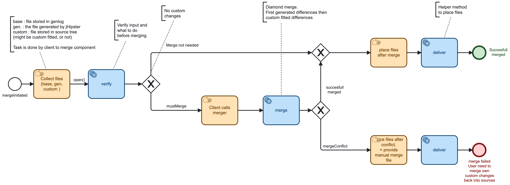
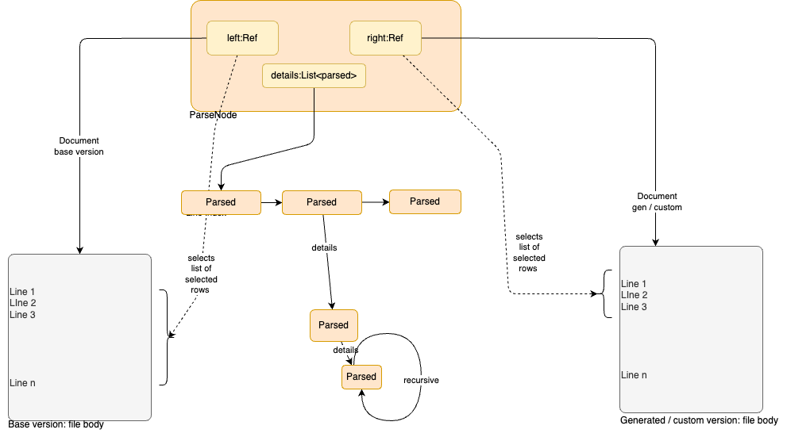

# Merge

- Merge adds 'three-way merge' to generated code.
- This means that users can custom fit the generated code and still get updates from jLite generators.

Figure: Merge Process. Verify, merge and deliver.

## Usage

- Each generated file will be stored in file-tree '.genlog...' See: [Genlog](GENLOG.md)
- And the generated file will also be added to 'src/main/...' just as today.
- Use [merge/Api.java](../../src/main/java/tech/jhipster/lite/merge/Api.java) to merge files.
- See sample: [merge/ApiTest.java](../../src/test/java/tech/jhipster/lite/merge/ApiTest.java)

## Merge principles

Figure: First make a patch list from **_gen_**. Then make a patch list from **_custom_**. The patch.

Merge starts with comparing **_base_** to **_gen_**
The **_base_** is the previous-generated file
The **_gen_** is the newly generated file. And it is seen as changes to **_base_**. Changes are isolated as **_patches_**
to **_base_** --> that will result in **_gen_**

Parallel **_base_** is compared to **_custom_** Also here a list of 'patches' is produced.

The final result is **_target_**.

## Recursive compare

Comparing is **_left_** side file that are updated with **_right_** side file.  
The compare principle is to find the largest fragment in file **_right_** that matches a fragment in **_left_**.
Everything before this fragment is recursive compare and so is everything after the matched fragment.

This recursive technique means that fragments get smaller and smaller
until a fragment is a single line, or the fragment is empty.
See [merge/impl/MergeTest.java](../../src/test/java/tech/jhipster/lite/merge/impl/MergeTest.java)

Figure: Merge is currently based on a **_line level_** compare. Merge finds the biggest equal fragment between the two files. And continue this in a recursive way.

## Deliver files

When the merge completes, then the client program inside jLite must store files. Merger has a helper class where the client implements **_lambda_**-function to store files.
Merger is abstracted from files, see: [Body.java](../../src/main/java/tech/jhipster/lite/merge/impl/Body.java).
See: [merge/Deliver.java](../../src/main/java/tech/jhipster/lite/merge/Deliver.java)

- 'client' must use lambda functions to answer where to locate files.
